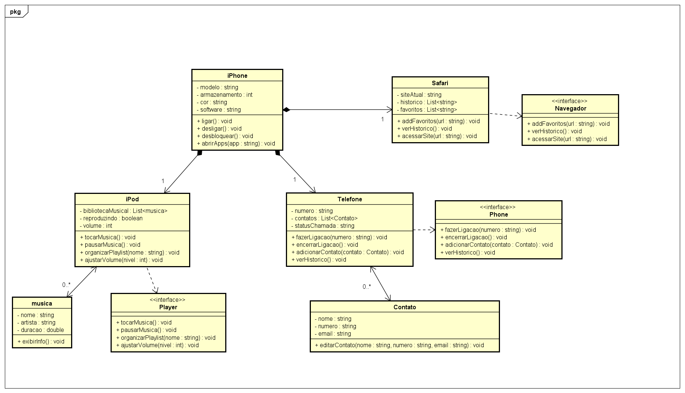

# POO - Desafio 📱
## Modelagem e Diagramação de um Componente iPhone
Neste desafio, você será responsável por modelar e diagramar a representação UML do componente iPhone, abrangendo suas funcionalidades como Reprodutor Musical, Aparelho Telefônico e Navegador na Internet.

## Contexto
Com base no vídeo de lançamento do iPhone de 2007 (link abaixo), você deve elaborar a diagramação das classes e interfaces utilizando uma ferramenta UML de sua preferência. Em seguida, implemente as classes e interfaces no formato de arquivos .java.

[Lançamento iPhone 2007](https://www.youtube.com/watch?v=9ou608QQRq8)

## Minha UML - Diagrama de classes

